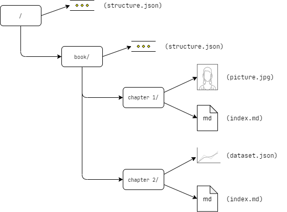

# capsule

`capsule` is a software framework that defines an opinionated, extensible content management model.

`capsule` provides solutions for _content authors_ to compose, curate, and publish collections of structured content as coherent publications. `capsule` has a specific focus on the indie web, and independent, non-platform publications.

`capsule` provides a programming framework, which allows _software developers_ to create and extend solutions in an organized, uniform manner with good encapsulation properties. `capsule` is implemented in clean, modern, idiomatic golang.

`capsule` is intended to be format agnostic. Use the same content collection to publish into a multiplicity of formats.

Use `capsule` when you need structure around your content workflow, but don't want a heavyweight content management system, and when a static site generator alone isn't quite enough.

## Capsules

In the `capsule` universe, we refer to a single "content repository" as a _capsule_. At this time, the concept of a capsule is more or less aligned with a single "publication", but this decision is not necessarily important to the framework.

The default content model included with `capsule` is a simple implementation built around a conventional filesystem tree. Filesystem primitives such as hierarchical directories, files, and file extensions are used along with `capsule`-specific conventions allowing content authors to encode semantic structure into their content.

The default filesystem-based capsule model will work on any reasonable computer system. Use a Raspberry Pi to manage your content workflow.

## Interfaces

`capsule` provides interfaces:

* around the filesystem structures defining a capsule, such that content authors have a stable representation to use in developing large, long-lived content repositories

* around the programming model used to operate on capsules, such that developers have a coherent set of abstractions that can be used to develop tooling and systems that operate on disparate capsules in a uniform way

* around the stock publishing toolkit and its extension points

* that allow for clean specialization through extension; developers *will not* have to create forks of `capsule` just to maintain their own customizations. Use capsule like an extensible framework

## Meta-structures

The `capsule` framework provides first-class support for _meta-structures_. Meta-structures are programmatically generated content derived from the concrete content contained within the capsule.

Content objects like tables of contents, indexes, search databases, or timelines would be examples of meta-structures. `capsule` provides framework interfaces for generating meta-structures within the framework, making those available downstream within content workflows such that they can be represented independently for different publishing formats.

Easily extend `capsule` with any kind of meta-structure you can imagine.

## The Filesystem

Using the filesystem as a facility for managing content objects allows content authors to work with any reasonable tooling for both creating content, and also for managing versions of capsules.

A tool like `git` (with LFS support enabled) could be used to manage versions of objects in a capsule. Any solution that can manage trees of files will be suitable for managing the versioned state of a capsule.

Like most other parts of `capsule`, if you want to use a different type of repository implementation you can replace the stock implementation through clean interfaces with well-defined semantics.

### Filesystem Primitives

`capsule` leverages the filesystem to represent a capsule as a hierarchical tree of _nodes_. Nodes contain a multiplicity of _features_.

In the above image, `/`, `book/`, and `chapter 1/` all represent nodes. `(structure.json)`, `(picture.jpg)`, etc. all represent features.

The implementer can decide if nodes should represent "pages" ("articles", "entries", etc.) or if nodes should represent larger structures like "chapters" or "books".

In the filesystem implementation, nodes are represented by directories and features are represented by files inside that directory. This gives us a good starting point to build capsules right out of the box.

## Static Web Compiler

`capsule` ships with a static web compiler reference implementation. The compiler is designed to be easily extensible to support multiple types of web structures ("blogs", "journals", "books", "wikis", "zettelkasten", etc.). The compiler itself provides interfaces separating its concerns and allowing for clean specialization through extension. A number of stock implementations and examples are included to make it easy to understand how to use `capsule` as the foundation for your own static web content strategy.

By default, the static compiler uses a node within a capsule to represent a "page", and features to represent the structured prose documents, images, multimedia, and other assets that are unique to that page.

## Changes to the Interfaces

`capsule` will provide migration paths for both content authors and for developers. Content authors will have reasonable tooling from `capsule` to allow them to migrate their capsules from older idioms to newer idioms. Software developers will have framework support for managing code supporting multiple `capsule` versions.

It is an important property of `capsule` that capsule structures remain stable, such that those capsules will be supported many years into the future. `capsule` is intended to be a long-term solution for content creation, publishing, and archival.

`capsule` is built upon the foundation of self-hosting, right-sized solutions, and the modern decentralized web. It aims to do this without sacrificing the right kinds of ergonomics for modern developers, and with a minimum of bloat.

## Roadmap

I am developing `capsule` to be the foundation for my long-term content strategy across several different web sites and publications. As such, I'm naturally tailoring the development to suit my own use cases. Getting to a `v0.1`, which includes the first generation model containing the relevant meta-structures, and a reasonably-baked static web compiler are my main goals. I will be dogfooding these bits in my own workflows across a number of projects involving multiple people.

In a `v0.2` I would like to develop a reasonable compiler implementation that can re-target capsules into single-document formats, like PDF.

It is also a target of interest to develop a compiler implementation targeting [Gemini][gemini].

I am actively interested in collaborators who are looking for a stable, modern, lightweight content management workflow.

[gemini]: https://gemini.circumlunar.space/